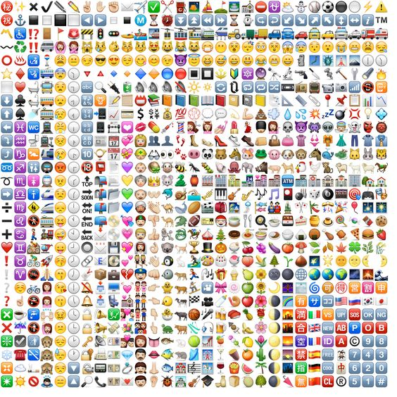

# RichTextEditor for angular
A simple Angular textEditor directive with support for emojis

## Running app link
  https://vishal21st.github.io/RichTextEditor/

## Features:
  1. currently you can enter code for :) or <3 and it will be turned into respective emoticons

## Dependencies:
  1. Angular

## Steps to use this directive:
1. include textEditor.js after including angular script in your app
  ``
2. add 'textEditor','ngSanitize' as Dependencies in your angular app
  `angular.module('app',['textEditor','ngSanitize']);`
3. add your model value to editor-value attribute in directive
`

`

## You can add your custom emojis and key binding by adding extra attribute "emoji-codes" to directive  

`

`:

add key value pairs
`var codes =  {
    ':)': { pattern: ":\\)",
            img: "</img>",
            type: "smile"
          }
  }`
